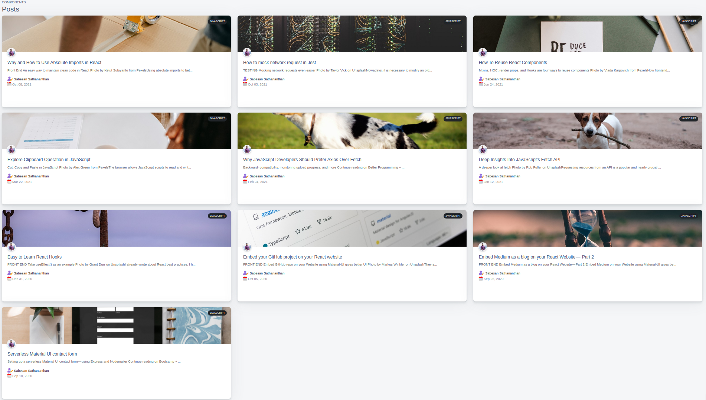

## UI

Here is the UI

## How to setup 
Read this [documentation](./docs/SETUP.md)📝

## How to use

`mediumURL = "https://api.rss2json.com/v1/api.json?rss_url=https://medium.com/feed/@MediumStaff";`

Use your medium user name👤 instead of MediumStaff. in [Slider.js](./src/components/Slider.js) 

## How to contribute
Read this [CONTRIBUTION.md](./docs/CONTRIBUTION.md)

## Finally 
Don't forget to give a star⭐️ for this repo ☺️
